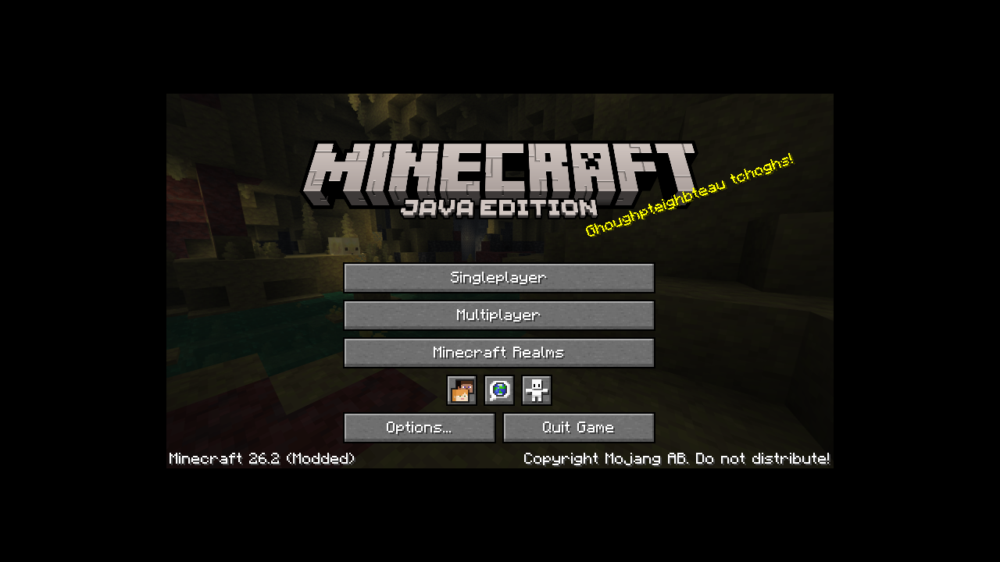
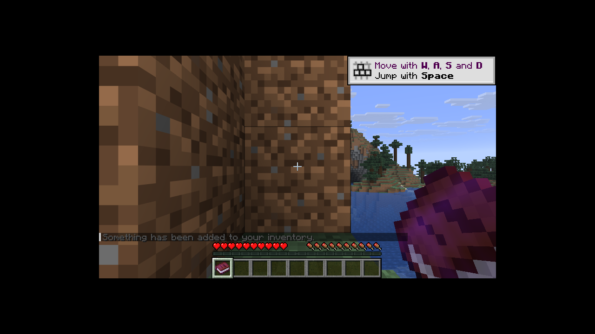
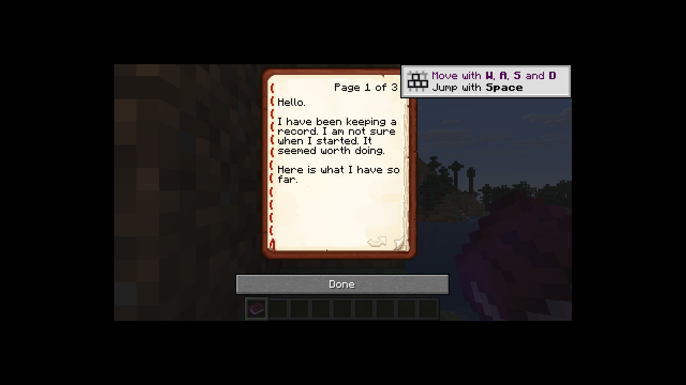

# Ledger

A Fabric mod for **Minecraft 26.2**.

Every block you mine is recorded. Every block you place, every item you use, every step
you take. For a long time nothing comes of it. Then a book turns up in your hotbar that
you did not write, signed by someone calling themselves **Earth**, and it knows exactly
how much stone you have taken.

Ledger also contains the gun bench it grew out of: **60 parts** across six sections,
combinable into **1,000,000 guns**, held inside a sustained-damage budget so wild builds
stay fun instead of round-ending.

---

## Building

Requires **JDK 25** (Minecraft 26.2 runs on Java 25).

```bash
./gradlew build      # or: gradle build
```

Finished jars land in **`builds/`**. The one you want is:

| File | Use it? |
| --- | --- |
| **`builds/ledger-1.0.0.jar`** | **Yes — this is the mod.** Drop it in your server's `mods/` folder alongside Fabric API |
| `builds/ledger-1.0.0-sources.jar` | No. Source code for IDEs only; the loader will not read it as a mod |

Ledger is entirely server-side logic, so no client install is needed. Only the mod jar is
committed to the repo; the sources jar is a local build product.

CI builds and tests on every push (`.github/workflows/build.yml`).

### Fabric on 26.2

Loom resolves Minecraft's mappings by itself now, so `build.gradle` deliberately has **no
`mappings` line** — declaring one (for example `loom.officialMojangMappings()`) fails on
26.x with `Failed to find official mojang mappings for 26.2`. The versions that work
together are pinned in `gradle.properties`:

```
minecraft_version=26.2
loader_version=0.19.3
loom_version=1.17-SNAPSHOT
fabric_api_version=0.156.0+26.2
```

Two 26.x API changes worth knowing if you extend this: `GameProfile` is a record now, so
it is `profile.name()` rather than `getName()`, and `Material.CHAIN` became `IRON_CHAIN`
once copper chains arrived.

---

## What works today

### The record

Every player has a `WatchRecord`. It counts, per registry id:

- blocks mined
- blocks placed
- items used
- blocks walked (sampled once a second — movement fires far too often to hook directly)
- creatures killed, deaths

Records persist to `<world>/ledger-records.json`, flushed every two minutes and on
shutdown. A surveillance state with amnesia is not frightening.

`totalInteractions()` — mined + placed + used + walked — is the single number the whole
escalation runs on.

### The gun bench

60 parts across Barrel, Core, Grip, Magazine, Sight and Stock. Individual parts are
deliberately lopsided; the ceiling is enforced centrally after assembly by hard caps plus
a 34 sustained-DPS budget that counts explosion power, solved directly so results land
exactly on the cap. Builds so pellet-heavy that even minimum damage would breach the
budget are slowed down instead.

`GunBalanceTest` verifies this exhaustively rather than by sampling: it assembles **all
1,000,000 possible guns** and asserts every one respects every cap.

---

## Commands

| Command | What it does |
| --- | --- |
| `/guns`, `/bench`, `/gunbench` | **Open the gun bench.** Short aliases for the main screen |
| `/ledger bench` | The same menu |
| `/ledger gun <preset>` | Merge and take a ready-made gun (`rpg`, `ak`, `sniper`, `maxigun`…) |
| `/ledger part <id>` | Fit one part onto your bench |
| `/ledger random` | Roll all six sections and take the result |
| `/ledger parts` | List every part id |
| `/ledger record` | Show what Earth has written down about you |

## Merging

The bench is a six-row chest menu with the slots used as buttons. Pick a part for each of
the six sections, watch the preview update, then press **MERGE INTO GUN**: the six parts'
effects are applied in section order, the balance pass runs once over the result, and out
comes a single item that remembers which parts made it.

Only the part ids and the round count are stored on the item; every stat is recomputed
from the parts on demand, so rebalancing a part updates every gun already in the world.

Nothing in the menu is a real item — clicks are intercepted before they reach the
container and quick-move is disabled, so buttons cannot be pulled out or duplicated.

## Not built yet

Named honestly, because the design is settled but the code is not written:

- **Cameras** — small watchers on trees and in caves that turn to face you.
  `models/camera.bbmodel` is the authored model.
- **The Earth book** — a written book of your real statistics, author "Earth", slipped
  into your hotbar after a few hundred records, hinting that something is watching.
- **THE WITNESS** — at 10,000 interactions the record assembles itself into a staged boss
  built from the blocks you mined, which names your inventory back to you.
  `models/witness.bbmodel` is the silhouette reference.
- **The cow.** No further comment.

## Models

`models/` holds hand-authored Blockbench files (`.bbmodel`, openable directly in
Blockbench). The Witness is intended to be assembled at runtime from block-display
entities using each player's own mined blocks, so its file is a silhouette reference
rather than a rig.

## Screenshots

Captured from the Fabric dev client (`./gradlew runClient`) running Minecraft 26.2
headless, under Xvfb with software GL.

| | |
| --- | --- |
|  | The title screen reading **Minecraft 26.2 (Modded)** — Ledger loaded |
|  | `/ledger book` puts the volume in the first free hotbar slot, with the delivery line in chat |
|  | Volume 1, page 1. Later pages print the player's real recorded figures |
