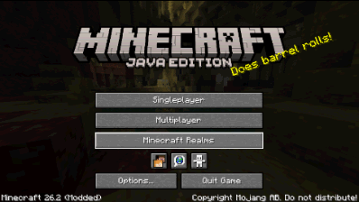
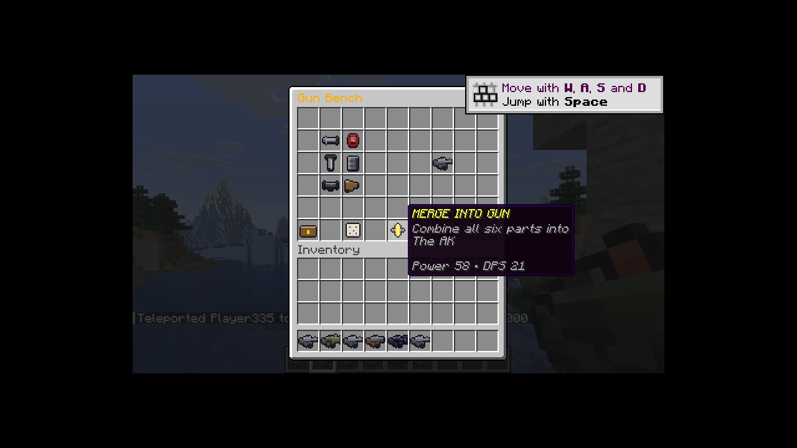
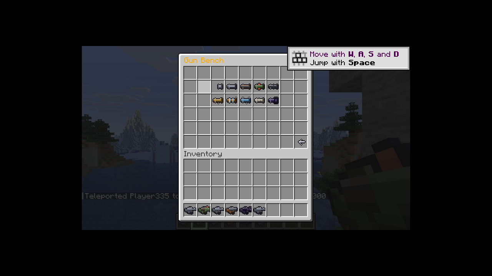
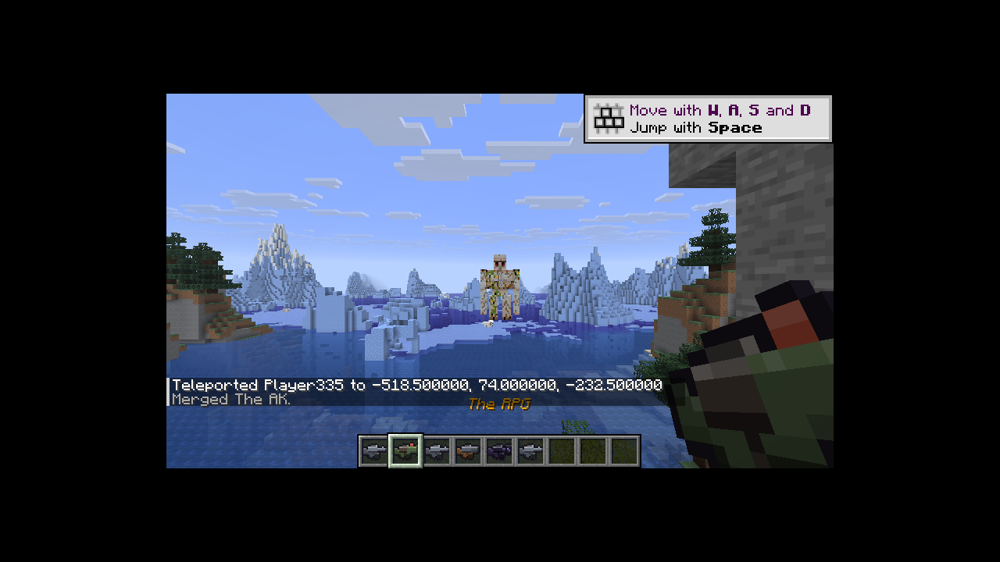
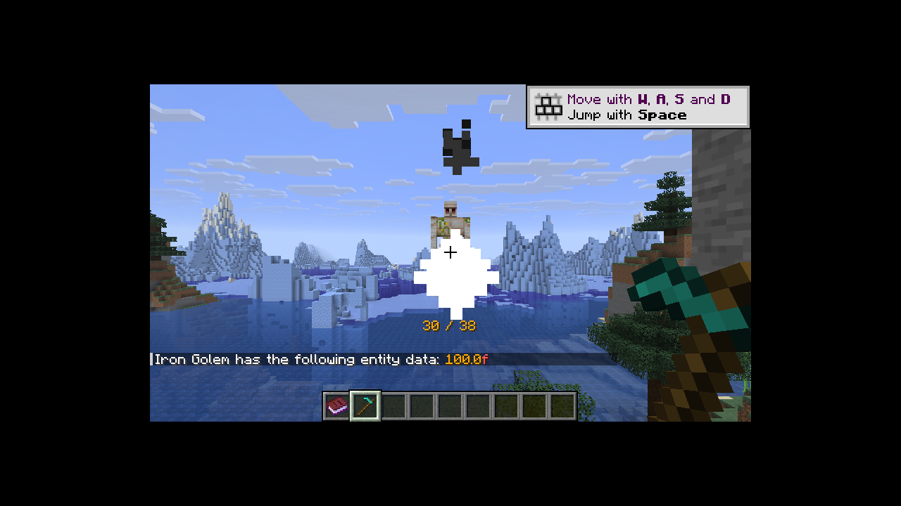
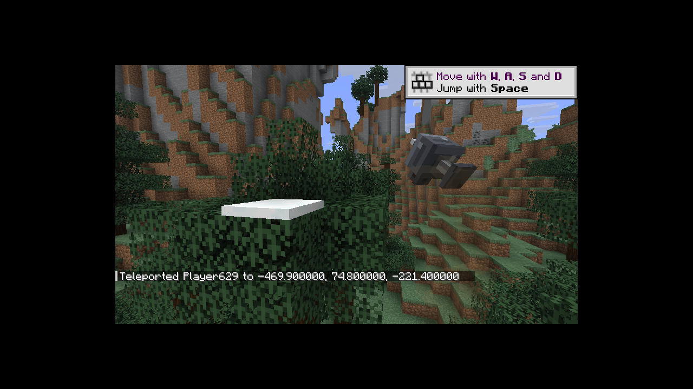
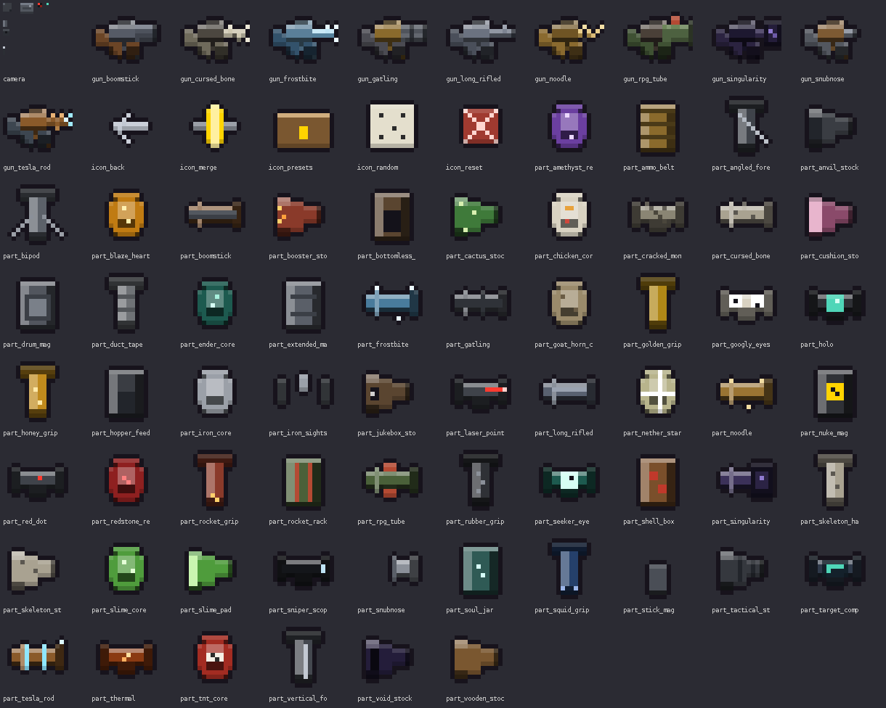

# Ledger

A Fabric mod for **Minecraft 26.2**.

Every block you mine is recorded. Every block you place, every item you use, every step
you take. For a long time nothing comes of it. Then a book turns up in your hotbar that
you did not write, signed by someone calling themselves **Earth**, and it knows exactly
how much stone you have taken.

Ledger also contains the gun bench it grew out of: **60 parts** across six sections,
combinable into **1,000,000 guns**, held inside a sustained-damage budget so wild builds
stay fun instead of round-ending.



*Title screen → the world → `/guns` → a barrel, core, grip, magazine, sight and stock →
**MERGE INTO GUN** → the Rapid Maxigun Mk.51 in hand, firing. Recorded from the real 26.2
dev client running headless; the world-loading stretch is compressed, nothing else is.
[How it was captured](#how-the-screenshots-were-made).*

---

## Building

Requires **JDK 25** (Minecraft 26.2 runs on Java 25).

```bash
./gradlew build      # or: gradle build
```

Finished jars land in **`builds/`**. The one you want is:

| File | Use it? |
| --- | --- |
| **`builds/ledger-1.0.0.jar`** | **Yes — this is the mod.** Drop it in your server's `mods/` folder alongside Fabric API |
| `builds/ledger-1.0.0-sources.jar` | No. Source code for IDEs only; the loader will not read it as a mod |

**Install it on the client too.** Ledger used to be pure server-side logic riding on
vanilla items, and a vanilla client could join without it. It now ships its own items and
its own art (see [Art](#art)), so a client without the mod would see missing models where
the guns are. Only the mod jar is committed to the repo; the sources jar is a local build
product.

CI builds and tests on every push and pull request (`.github/workflows/build.yml`), and on
every push it also:

- replaces `builds/ledger-1.0.0.jar` in the repo so the current jar is browsable
- attaches the jar to the workflow run as an artifact
- **publishes a GitHub Release** tagged `build-<number>` with the jar attached, so there is
  always a plain download link under
  [Releases](https://github.com/MilkdromedaStudios/Wierd-Gun-Game/releases)

If the "Replace the jar in /builds" step reports *"The committed jar already matches this
build"*, that is the step working: a code commit made with a locally built jar already
contains the right binary. It only has something to do when source is pushed without a
build.

### Fabric on 26.2

Loom resolves Minecraft's mappings by itself now, so `build.gradle` deliberately has **no
`mappings` line** — declaring one (for example `loom.officialMojangMappings()`) fails on
26.x with `Failed to find official mojang mappings for 26.2`. The versions that work
together are pinned in `gradle.properties`:

```
minecraft_version=26.2
loader_version=0.19.3
loom_version=1.17-SNAPSHOT
fabric_api_version=0.156.0+26.2
```

Two 26.x API changes worth knowing if you extend this: `GameProfile` is a record now, so
it is `profile.name()` rather than `getName()`, and `Material.CHAIN` became `IRON_CHAIN`
once copper chains arrived.

---

## What works today

### The record

Every player has a `WatchRecord`. It counts, per registry id:

- blocks mined
- blocks placed
- items used
- blocks walked (sampled once a second — movement fires far too often to hook directly)
- creatures killed, deaths

Records persist to `<world>/ledger-records.json`, flushed every two minutes and on
shutdown. A surveillance state with amnesia is not frightening.

`totalInteractions()` — mined + placed + used + walked — is the single number the whole
escalation runs on.

### The gun bench

60 parts across Barrel, Core, Grip, Magazine, Sight and Stock. Individual parts are
deliberately lopsided; the ceiling is enforced centrally after assembly by hard caps plus
a 34 sustained-DPS budget that counts explosion power, solved directly so results land
exactly on the cap. Builds so pellet-heavy that even minimum damage would breach the
budget are slowed down instead.

`GunBalanceTest` verifies this exhaustively rather than by sampling: it assembles **all
1,000,000 possible guns** and asserts every one respects every cap.

---

## Commands

Every command. `/ledger` on its own opens the gun bench.

### Guns

| Command | What it does |
| --- | --- |
| `/guns` · `/bench` · `/gunbench` | **Open the gun bench.** Short aliases for the main screen |
| `/ledger bench` · `/ledger menu` | The same bench |
| `/ledger gun <preset>` | Merge and take a ready-made gun. Tab-completes |
| `/ledger part <id>` | Fit a single part onto your bench. Tab-completes all 60 |
| `/ledger random` | Roll all six sections and take the result |
| `/ledger parts` | Print every part id, grouped by section |

### The record and Earth

| Command | What it does |
| --- | --- |
| `/ledger record` | Show what Earth has written down about you |
| `/ledger book` | Hand over the next volume early, instead of waiting 300 interactions |

### Cameras

| Command | What it does |
| --- | --- |
| `/ledger camera` | Place one nearby now, instead of waiting for it to appear |
| `/ledger clearcameras` | Remove every camera around you |

### The ending

| Command | What it does |
| --- | --- |
| `/ledger witness` | Summon THE WITNESS now, instead of waiting for 10,000 interactions |
| `/ledger stopwitness` | Dismiss it and clean up its body |
| `/ledger cow` | Run the ending on its own. It takes about seven seconds |

### Gun presets

Usable with `/ledger gun <preset>`:

`ak` · `sniper` · `shotgun` · `rpg` · `maxigun` · `boomrifle` · `chicken_cannon` ·
`nuke_pistol` · `blackhole` · `stormbringer` · `frostbite` · `noodle_nailer`

## Merging

The bench is a six-row chest menu with the slots used as buttons. Pick a part for each of
the six sections, watch the preview update, then press **MERGE INTO GUN**: the six parts'
effects are applied in section order, the balance pass runs once over the result, and out
comes a single item that remembers which parts made it.

Only the part ids and the round count are stored on the item; every stat is recomputed
from the parts on demand, so rebalancing a part updates every gun already in the world.

Nothing in the menu is a real item — clicks are intercepted before they reach the
container and quick-move is disabled, so buttons cannot be pulled out or duplicated.

## Firing

Right-click fires. Hold it for automatics — Minecraft only reports a click on air once, so
a held trigger is a short window that each click refreshes and the tick loop fires inside.
**Sneak to aim**, which cuts spread to about a third. Sprinting and being airborne widen it.

Rounds are hitscan, resolved the same tick, because the fastest builds fire twenty times a
second and simulated projectiles at that rate would be a thousand entities a minute for no
visible gain. Pellets, spread, damage, range, pierce, knockback, lifesteal, incendiary and
blast all come from the merged stats, so the balance pass that governs the bench governs
the bullets.

Headshots multiply damage and pop a crit. Explosions do their own falloff rather than
calling vanilla's, which would grind the terrain into craters. **Reloading starts on its
own** when the magazine runs dry — there is no key to learn and no way to be stuck holding
an empty gun.

## The cameras

Small observers that appear in the trees and in dark places underground, hanging with the
lens angled down.

They do nothing. They do not track you, report you, or react. That is the whole feature:
the book has been implying for several volumes that something is watching, and a camera
that visibly reacted would answer the question, whereas one that simply exists leaves it
open. The record is kept whether or not any camera can see you.

Each is an invisible armour stand wearing `ledger:camera` on its head — a purpose-built
seven-box model, so the thing in the tree actually looks like a camera. Those boxes are
declared once in the generator and written out twice, as the model the game loads and as
`models/camera.bbmodel`, so the file you open in Blockbench and the thing in the tree cannot
drift apart.

Rounds pass straight through them. They are invulnerable armour stands, and until recently
that meant a camera in a tree silently ate your bullets.

They will only place somewhere with something to bolt to: a ceiling, a trunk or a cave wall
within reach. `/ledger camera` is the exception and will hang one in open air ahead of you
if there is no anchor, because a debug command that silently does nothing is worse than a
camera somewhere implausible.

## The ending

At **10,000 interactions across the world** — everyone's mining counts toward the same
tally — the record stops being a record and stands up.

**THE WITNESS** is a halo of 24 invisible armour stands, each balancing one block on its
head, orbiting an invisible core. The blocks it wears are taken from what players actually
mined, so every Witness is assembled out of its own victims' habits. Four stages keyed to
its health, each faster and angrier. Between attacks it reads your held item back to you by
name — it does not threaten, it recites.

Kill it and it says *"The record is closed."*

Then a cow wanders in. It has no boss bar, no glow, no name and no hostility, and it is an
ordinary cow in every respect the game can measure. About seven seconds later it kills
everyone present.

## Not built yet

The Witness and the cow have been built, and the Witness has since been made actually
killable — its halo of twenty-four invulnerable armour stands used to absorb every round
before it reached the core, so a hit anywhere on the halo is now moved onto the core and
the boss's hitbox is the whole wheel of blocks you can see. Neither the fight nor the
ending has been watched running in a live world yet, so treat that pair as untested.

## Art

Every sprite the mod uses is its own. Nothing borrows a vanilla item any more — guns were
hoes, barrels were blaze rods, cameras were observer blocks, and it all looked like what it
was: placeholders.

Everything under `src/main/resources/assets/ledger/` is **generated output**. The art is
authored in `tools/GenerateAssets.java` and drawn from there:

```bash
java tools/GenerateAssets.java     # rewrites every texture, model and item definition
```

Writing it as a program rather than in an image editor buys three things: the art is
reviewable in a diff, a palette change is one edit rather than sixty, and every sprite goes
through the same outliner and shading pass — which is most of what makes a set of 16×16
icons look like a set instead of a pile.

| What | How many | How it is drawn |
| --- | --- | --- |
| Guns | 10 | One per barrel, since the barrel is what changes a gun's outline. Everything behind the muzzle is shared so the family reads as a family |
| Parts | 60 | Each section's silhouette in that part's own colours, with a small distinguishing mark on top |
| Menu buttons | 5 | Merge, reset, back, randomise, presets |
| Camera | 1 | A seven-box 3D model — mount plate, arm, housing, lens barrel, lens, status light, antenna — worn on the armour stand's head |

Only **three items** are registered (`ledger:gun`, `ledger:icon`, `ledger:camera`); the look
is picked by a `custom_model_data` string, so the item definitions in
`assets/ledger/items/` do the dispatch. Adding a part means adding a sprite, not a registry
entry.

`AssetCoverageTest` walks every part, barrel and preset back through that chain — item
definition, model, texture — and fails the build if any link is missing, because a
forgotten regeneration otherwise shows up only as a purple-and-black cube in the menu.

`models/` additionally holds hand-authored Blockbench files (`.bbmodel`, openable directly
in Blockbench) for the camera and the Witness. The Witness is assembled at runtime from
armour stands wearing each player's own mined blocks, so its file is a silhouette reference
rather than a rig.

## Screenshots

Captured from the Fabric dev client (`./gradlew runClient`) running Minecraft 26.2
headless, under Xvfb with software GL.

| | |
| --- | --- |
|  | The title screen reading **Minecraft 26.2 (Modded)** — Ledger loaded |
|  | `/ledger book` puts the volume in the first free hotbar slot, with the delivery line in chat |
|  | Volume 1, page 1. Later pages print the player's real recorded figures |
|  | `/guns` — six section buttons, a live preview of the merged gun, and the merge tooltip reading its real power and DPS |
|  | The barrel page: ten barrels, ten silhouettes |
|  | The RPG held, with six merged guns along the hotbar |
|  | Mid-burst on an iron golem: tracer, muzzle smoke and the live ammo counter |
|  | One of the cameras, bolted to a cliff, lens angled at the floor. It does nothing |
|  | All 76 generated sprites at 6×. The scattered tiles in the top-left corner are the camera's UV sheet — it is a 3D model, not an icon |

## How the screenshots were made

There is no display, no GPU and no screenshot tool in the environment this was built in,
so the game was run and driven entirely headless. Recorded here because it is genuinely
reusable for testing any Fabric mod in CI.

**1. A virtual screen.** `Xvfb` provides an X server that draws into memory rather than a
monitor:

```bash
Xvfb :99 -screen 0 1280x720x24 &
export DISPLAY=:99
```

**2. Software OpenGL.** Minecraft needs GL, and there is no graphics card, so Mesa renders
on the CPU with llvmpipe:

```bash
export LIBGL_ALWAYS_SOFTWARE=1 GALLIUM_DRIVER=llvmpipe
export MESA_GL_VERSION_OVERRIDE=3.3 MESA_GLSL_VERSION_OVERRIDE=330
./gradlew runClient
```

Startup takes several minutes this way. It is slow, not broken.

**3. Capture and control with `java.awt.Robot`.** `import`, `xwd`, `scrot`, `ffmpeg` and
`xdotool` are all absent, but the JDK already ships a class that grabs the screen *and*
synthesises mouse and keyboard input against the same X display — so it replaces both the
missing screenshot tool and the missing automation tool:

```java
Robot robot = new Robot();
ImageIO.write(robot.createScreenCapture(screenBounds), "png", file);  // screenshot
robot.mouseMove(x, y); robot.mousePress(BUTTON1_DOWN_MASK);           // click
robot.keyPress(KeyEvent.VK_SLASH);                                    // type
```

`tools/Drive.java` is that helper. It takes a small script and executes it against the live
game:

```
click,638,355;wait,2500;cmd:guns;wait,2500;click,530,225;hold,3000;shot,out.png
```

`cmd:` opens chat with `/`, types the rest and presses Enter; `hold` holds right-click,
which is how an automatic keeps firing.

**4. The video, without a video tool.** There is no `ffmpeg` either, so the GIF at the top
is made by two more small programs. `tools/Record.java` grabs the 854×480 viewport on a
timer and writes downscaled frames; `tools/Gif.java` assembles them using the JDK's own GIF
writer, which will do animation if you hand-build the metadata — a `GraphicControlExtension`
for the frame delay and the NETSCAPE application extension for the loop.

The one clever bit is that it drops frames that barely differ from the last one kept, with
a cap on how many it will skip in a row. World loading takes a minute and a half of an
almost-still screen; that collapses to a couple of frames, and the parts of the clip where
something is happening keep every frame. 1,522 captured frames became 139.

```bash
java tools/Record.java frames 8 175          # 8 fps for 175 seconds
java tools/Gif.java frames demo.gif 13 2.5 45 0.83
```

**5. Actually playing.** Clicked through the title screen, loaded the world, ran
`/gamemode creative` and `/guns`, clicked each of the six sections and picked a part from
each, hovered **MERGE INTO GUN** to show its real power and DPS, clicked it, selected the
merged gun and held right-click — all through `Robot`, screenshotting between steps to find
the next button.

### What this proved, and what it did not

The three screenshots above are real frames from a running game, not mock-ups: the mod
loading on 26.2, the book arriving in the hotbar with its delivery message, and the book's
own text rendered by Minecraft.

**THE WITNESS and the cow have not been seen running.** They compile and are committed, but
every attempt to relaunch the client after that first successful session died on X server
plumbing. Run `/ledger witness` locally and you will know in seconds.
